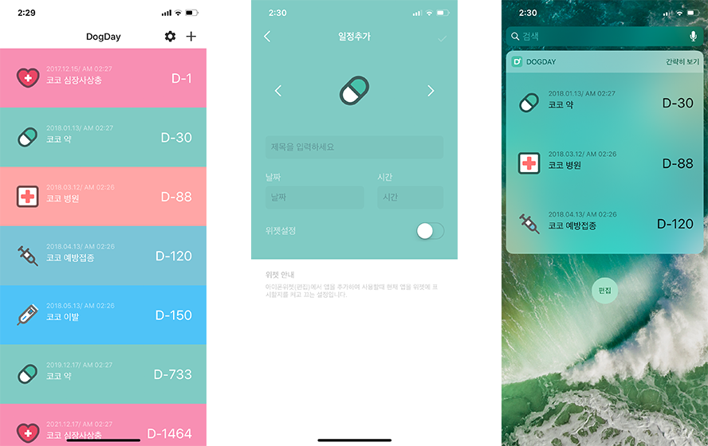

### DogDay
반려견을 위한 D-Day 앱입니다.

---

### iOS AppStore
아이폰 앱 스토어에서 앱을 다운로드 받을 수 있습니다.
 
 

[//]: # (These are reference links used in the body of this note and get stripped out when the markdown processor does its job. There is no need to format nicely because it shouldn't be seen. Thanks SO - http://stackoverflow.com/questions/4823468/store-comments-in-markdown-syntax)
